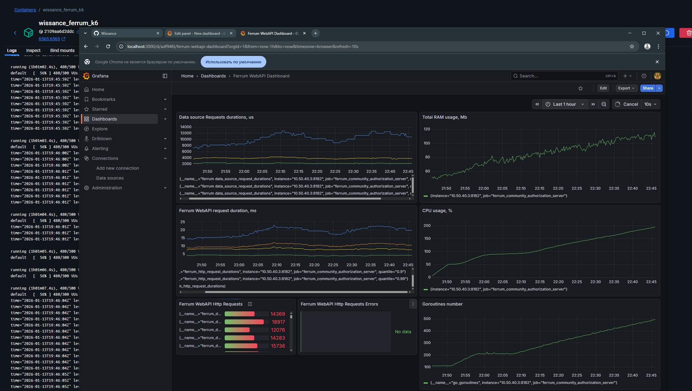
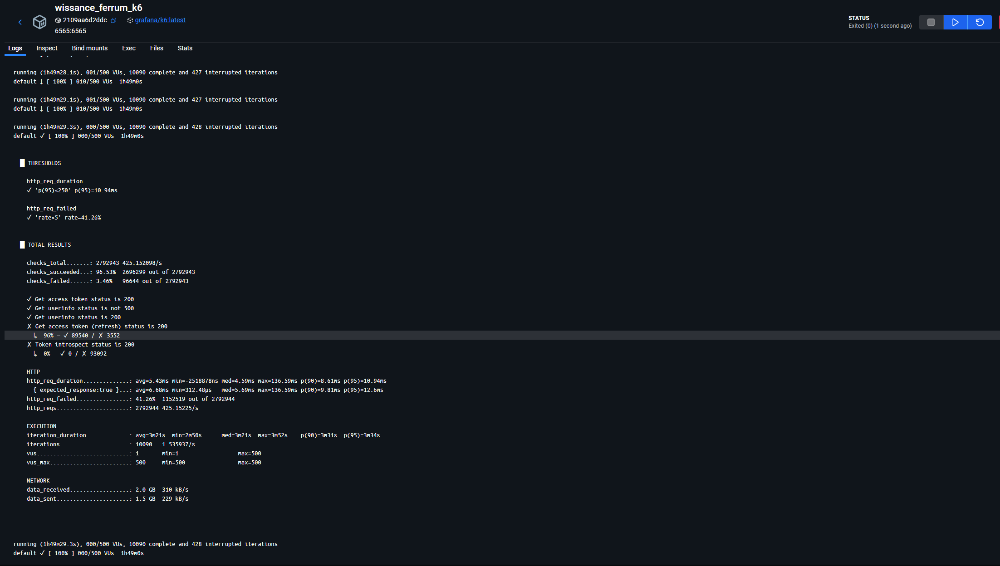
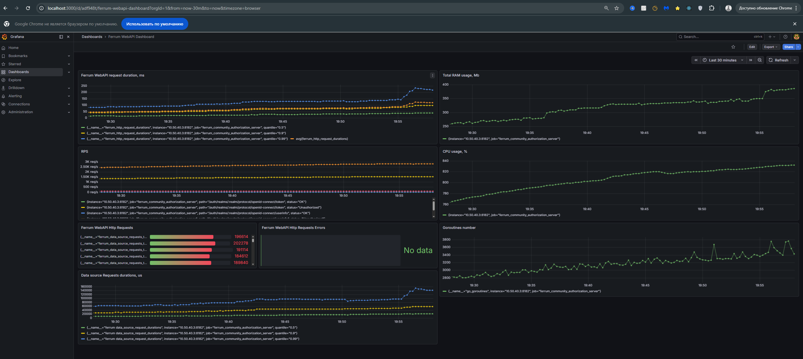
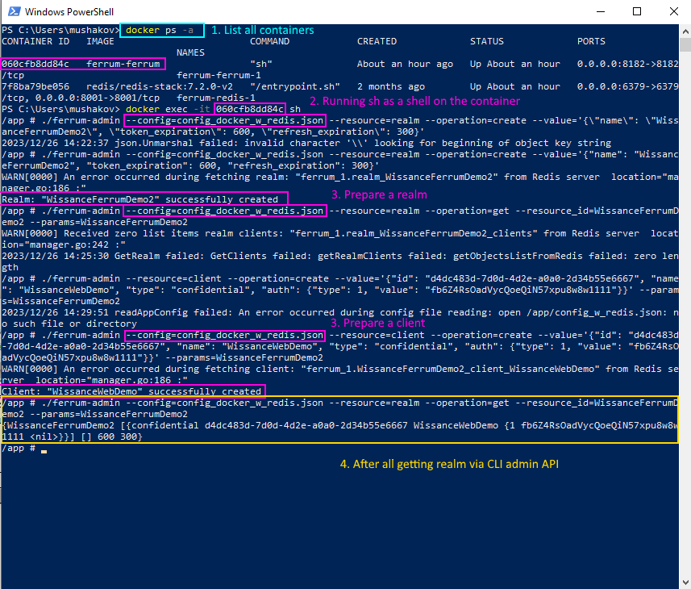
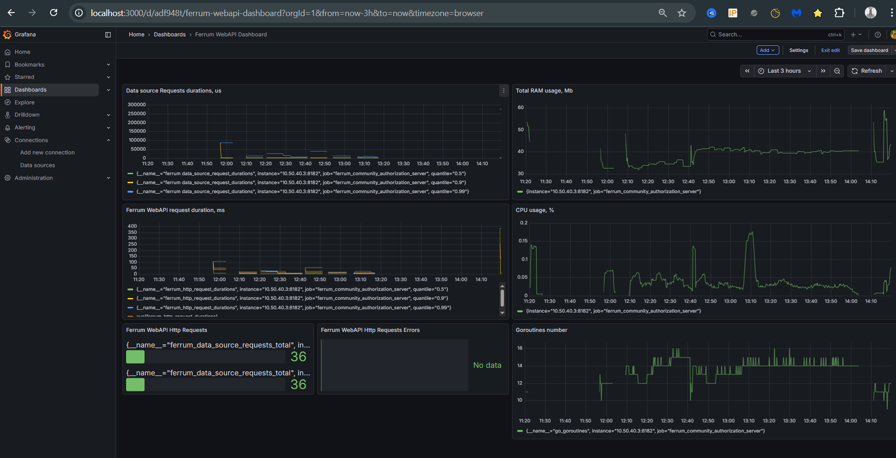

# Ferrum

`Ferrum` (`Ferrum Community Authorization Server`) is a Authorization Server that is
* :comet:fast, [see](#452-performance-testing)
* :fire:low resource consumption, 
* :heavy_check_mark:fully tested including performance testing

 
 

 
[](https://goreportcard.com/report/github.com/wissance/Ferrum)
[](https://github.com/Wissance/Ferrum/actions/workflows/ci.yml)
[](https://goreportcard.com/report/github.com/wissance/Ferrum)
[](https://coveralls.io/github/Wissance/Ferrum?branch=master)


## 1. Why Ferrum

### 1.1 Main Ferrum advantages:
* :white_check_mark: Simple configuration and start either as a **native app** or an `docker` containerized app;
* :sparkles: `Keycloak-compatible API`
* :boom: Can be **embedded** inside any application or used as a *standalone* application
* :film_strip: Can be simply install absolutely with no dependent services to single board computer with `low resource usage`, requires `40-50 Mb` of `RAM` with up to `100 - 200 users`;
* :stars: *fast* (there are no performance test yet, but they will be written during the `0.9.3` version) with aim to be serving up to `10K users on a single node`, `0.9.3.rc1` `K6` automated performance tests shows **500 users** simultaneous work with `~20ms 99% of requests` with < `130 Mb of RAM`  and `2 CPU Cores` usage;
* :heavy_check_mark: `Ferrum` is widely covered by unit and integration tests every push on `develop` or `master` runs tests and static analyze check with `linters`.
* :desktop_computer: `metrics` allow to control all HTTP-requests duration and those part related to data storage access with count three groups by request time - `p50`, `p90` and `p99` also metrics count total amount of requests and errors during requests handling.
* :microscope: during to modular parts and interface usage, `Ferrum` could be used with any type of persistent storage 

## 2. Communication

* [Discord channel](https://discord.gg/9RYNYu2Mxq)
* [Telegram channel](t.me/ferrum_community_authserver)

## 3. General info

`Ferrum` is `OpenId-Connect` Authorization server written on GO. It has Data Contract similar to
`Keycloak` server (**minimal `Keycloak`** and we'll grow to full-fledged `KeyCloak` analog).

Today we are having **following features**:

1. `Issue` new `tokens`.
2. `Refresh tokens`.
2. Control user sessions (token expiration).
3. Get `UserInfo`.
4. Token `Introspect`.
4. Managed from external code (`Start` and `Stop`) making them an ***ideal candidate*** for using in ***integration
   tests*** for WEB API services that uses `Keycloak` as authorization server;
5. Ability to use different data storage:
   * `FILE` data storage for small Read only systems
   * `REDIS` data storage for systems with large number of users and small response time;
6. Ability to use any user data and attributes (any valid JSON but with some requirements), if you have to
   properly configure your users just add what user have to `data.json` or in memory
7. Ability to ***become high performance enterprise level Authorization server***.

it has `endpoints` SIMILAR to `Keycloak`, at present time we are having following:

1. Issue and Refresh tokens: `POST ~/auth/realms/{realm}/protocol/openid-connect/token`
2. Get UserInfo `GET  ~/auth/realms/{realm}/protocol/openid-connect/userinfo`
3. Introspect tokens `POST ~/auth/realms/{realm}/protocol/openid-connect/token/introspect`

## 4. How to use

### 4.1 Build

First of all build is simple run `go build` from application root directory. Additionally it is possible
to generate self signed certificates - run `go generate` from command line

If you don't specify the name of executable (by passing -o {execName} to go build) than name of executable = name of project

For running static analyze check use command `golangci-lint run`

### 4.2 Run application as Standalone

Run is simple (`Ferrum` starts with default config - `config.json`):
```ps1
./Ferrum
```

To run `Ferrum` with selected config i.e. `config_w_redis.json` :

```ps1
./Ferrum --config ./config_w_redis.json
```

### 4.3 Run application in docker

It is possible to start app in docker with already installed `REDIS` and with initial data (see python
data insert script):

```ps1
    docker-compose up --build 
```

### 4.4 Run with direct configuration && data pass from code (embedding Authorization server in you applications)

There are 2 ways to use `Ferrum`:
1. Start with config file (described above)
2. Start with direct pass `config.AppConfig` and `data.ServerData` in application, i.e.
   ```go
    app := CreateAppWithData(appConfig, &testServerData, testKey)
	res, err := app.Init()
	assert.True(t, res)
	assert.Nil(t, err)

	res, err = app.Start()
	assert.True(t, res)
	assert.Nil(t, err)
	// do what you should ...
	app.Stop()
   ```

### 4.5 Testing

### 4.5.1 Functional testing

At present moment we have 2 fully integration tests, and number of them continues to grow. To run test execute from cmd:
```ps1
go test
```
For running Manager tests on `Redis` you must have redis on `127.0.0.1:6379` with `ferrum_db` / `FeRRuM000` `auth` `user+password`
pair, it is possible to start docker_compose and test on compose `ferrum_db` container 

### 4.5.2 Performance testing
Performance test running automatically with `K6` included in separate [docker-compose](./docker-compose.perf) running with powershell script - `start_docker_perftests.ps1`. `K6` tests itself located in `tools folder` started with prefix `k6`:
* `k6_smoke_test.js` - small load with 10 users with 1 min duration;
* `k6_average_load_test.js` - average load with up to 500 users running ~ `1 hour`
* `k6_high_load_test.js` - high load up to 10000 users ~`1 day`

Result of running `avg load` - 10 ms average response time, `p99` (99% of requests) duration around `20 ms`, maximum RAM usage during this test is `130 Mb` and takes `2 CPU Cores`, see results below:



And Summary of result from the K6 window:


Result of running `high load` - ~3500 users and 5000 RPS gives `~400Mb` usage and `8 CPU Cores` with `p95` ~70-80 ms, see:




## 5. Configure

### 5.1 Server configuration

Configuration splitted onto several sections:

        ```json
        "server": {
            "schema": "https",
            "address": "localhost",
            "port": 8182,
            "security": {
                "key_file": "./certs/server.key",
                "certificate_file": "./certs/server.crt"
            }
        }
        ```
      - data file: `realms`, `clients` and `users` application takes from this data file and stores in 
        app memory, data file name - `data.json`
      - key file that is using for `JWT` tokens generation (`access_token` && `refresh_token`), 
        name `keyfile` (without extensions).

### 5.2 Configure user data as you wish

Users does not have any specific structure, you could add whatever you want, but for compatibility
with keycloak and for ability to check password minimal user looks like:
```json
{
    "info": {
        "sub": "" // <-- THIS PROPERTY USED AS ID, PROBABLY WE SHOULD CHANGE THIS TO ID
        "preferred_username": "admin", // <-- THIS IS REQUIRED
        ...
    },
    "credentials": {
        "password": "1s2d3f4g90xs" // <-- TODAY WE STORE PASSWORDS AS OPENED
    }
}
```

in this minimal user example you could expand `info` structure as you want, `credentials` is a service structure,
there are NO SENSES in modifying it.

### 5.3 Server embedding into application (use from code)

Minimal full example of how to use could be found in `application_test.go`, here is a minimal snippet:

```go
var (
	testSalt           = "salt"
	encoder            = encoding.NewPasswordJsonEncoder(testSalt)
	testHashedPassword = encoder.GetB64PasswordHash("1234567890")
	testKey            = []byte("qwerty1234567890")
	testServerData     = data.ServerData{
		Realms: []data.Realm{
			{
				Name: testRealm1, TokenExpiration: testAccessTokenExpiration, RefreshTokenExpiration: testRefreshTokenExpiration,
				Clients: []data.Client{
					{Name: testClient1, Type: data.Confidential, Auth: data.Authentication{
						Type:  data.ClientIdAndSecrets,
						Value: testClient1Secret,
					}},
				},
				Users: []interface{}{
					map[string]interface{}{
						"info": map[string]interface{}{
							"sub":  "667ff6a7-3f6b-449b-a217-6fc5d9ac0723",
							"name": "vano", "preferred_username": "vano",
							"given_name": "vano ivanov", "family_name": "ivanov", "email_verified": true,
						},
						"credentials": map[string]interface{}{"password": testHashedPassword},
					},
				},
				PasswordSalt: testSalt,
			},
		},
	}
)

var httpsAppConfig = config.AppConfig{ServerCfg: config.ServerConfig{Schema: config.HTTPS, Address: "127.0.0.1", Port: 8672,
	Security: config.SecurityConfig{KeyFile: "./certs/server.key", CertificateFile: "./certs/server.crt"}}}
	
app := CreateAppWithData(appConfig, &testServerData, testKey)
res, err := app.Init()
if err != nil {
	// handle ERROR
}

res, err = app.Start() 

if err != nil {
	// handle ERROR
}

// do whatever you want

app.Stop()
```

## 6. Server administer

Since version `0.9.1` it is possible to use `CLI Admin` [See](api/admin/cli/README.md)

### 6.1 Use CLI admin in a docker

1. Run docker compose - `docker compose up --build`
2. List running containers - `docker ps -a`
3. Attach to running container using listed hash `docker exec -it 060cfb8dd84c sh`
4. Run admin interface providing a valid config `ferrum-admin --config=config_docker_w_redis.json ...`, see picture



### 6.2 Observability (SRE)

For checking application state, we could query the `~/metrics` endpoint (i.e., for local instance full `URL` - `http://127.0.0.1/metrics`). But starting with `0.9.3.rc1` were added `prometheus` and `grafana` to be running simultaneously with `Ferrum` using `docker-compose`. `Grafana` model could be found [here](/prometheus/grafana_ferrum_dashboard_model.json). It requires only replacing the Prometheus ID.

`Grafana` model allows us to observe the following:

1. `HTTP-request` duration with calculation average requests duration.
2. The total number of `HTTP-request` and requests ended with `4xx` and `5xx` status codes.
3. Data source operation duration to see where it could be the bottleneck and observe `CLI` admin interface too.
4. Resident memory consumption
5. `CPU` in % consumption
6. Number of goroutines used by Go
7. `RPS`

Screenshot with grafana dashboard:


## 7. Changes

Brief info about changes in releases.

### 7.1 Changes in 0.0.1

Features:
* `Keycloak` compatible HTTP-endpoints to issue a new `token` and to get `userinfo`

### 7.2 Changes in 0.1.0

Features:
* documentation (`readme.md` file)
* integration tests

### 7.3 Changes in 0.1.1

Features:
* fixed modules names

### 7.4 Changes in 0.1.2

Features:
* changed module names to make it available to embed `Ferrum` in an other applications

### 7.5 Changes in 0.1.3

Features:
* `Keycloak` compatible HTTP-endpoint for token introspect

### 7.6 Changes in 0.1.4

Features:
* removed `/` therefore it is possible to interact with `Ferrum` using `go-cloak` package

### 7.7 Changes in 0.9.0

Features
* logging
* implemented token refresh
* better docs

### 7.8 Changes in 0.9.1

Features:
* `docker` && `docker-compose` for app running
* admin `CLI` `API`
* `Redis` as a production data storage

### 7.9 Changes in 0.9.2

Features:
* admin cli added to docker
* test on `Redis` data manger
* used different config to run locally and in docker
* newer `Keycloak` versions support
* checked stability if `Redis` is down, `Ferrum` does not crushes and wait until `Redis` is ready
* `swagger` (`-devmode` option in cmd line) and `Keycloak` compatible HTTP endpoint `openid-configuration`
* support for federated user (without full providers impl, just preliminary)
* store password as a hashes

### 7.10 Changes in 0.9.3.rc1

* created `service admin account` and server settings
* created rules of matrix to check allowed operations with domain objects based on current user
* added `SRE metrics` to check `Ferrum` state with `Grafana` dashboard
* added automatic tests with `K6` and checked performance with `~20ms` on request with 500 users simultaneously.

### 7.11 Changes in 0.9.3.rc2

* switched from `gorilla/mux` to `gin-gonic/gin`
* confirmed that `Ferrum` could handle `~3500 users with 5000 RPS`

## 8. Contributors

<a href="https://github.com/Wissance/Ferrum/graphs/contributors">
  
</a>
